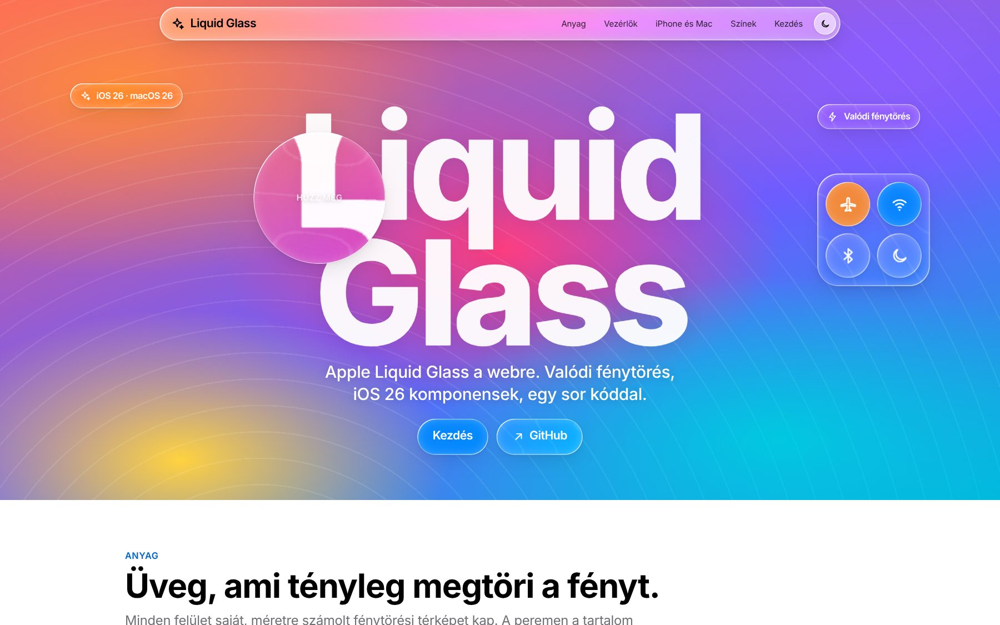
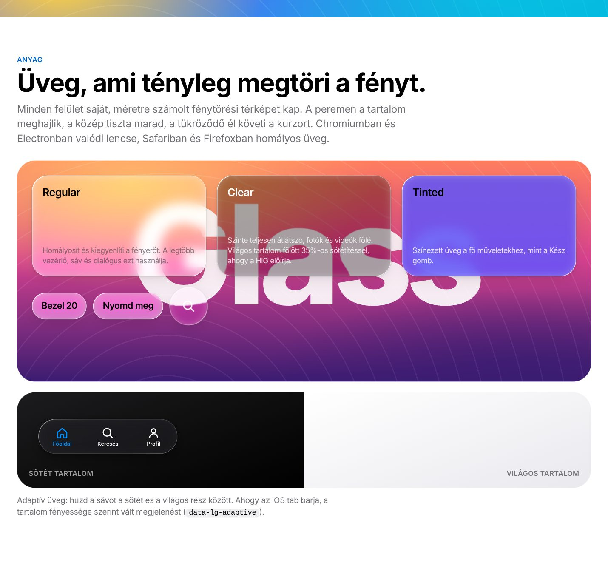
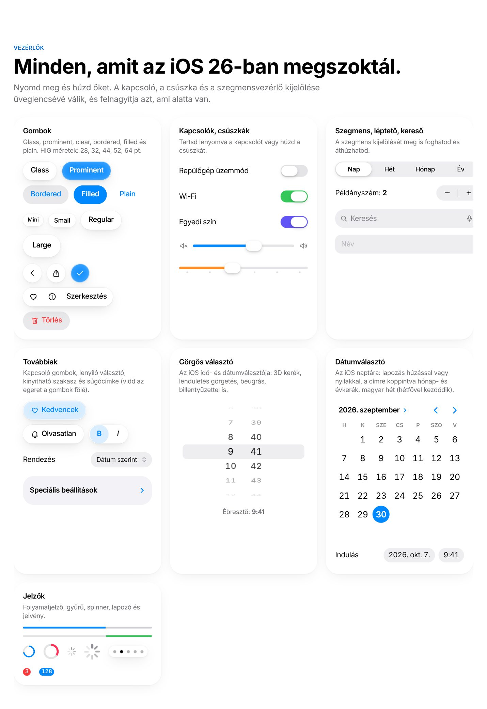
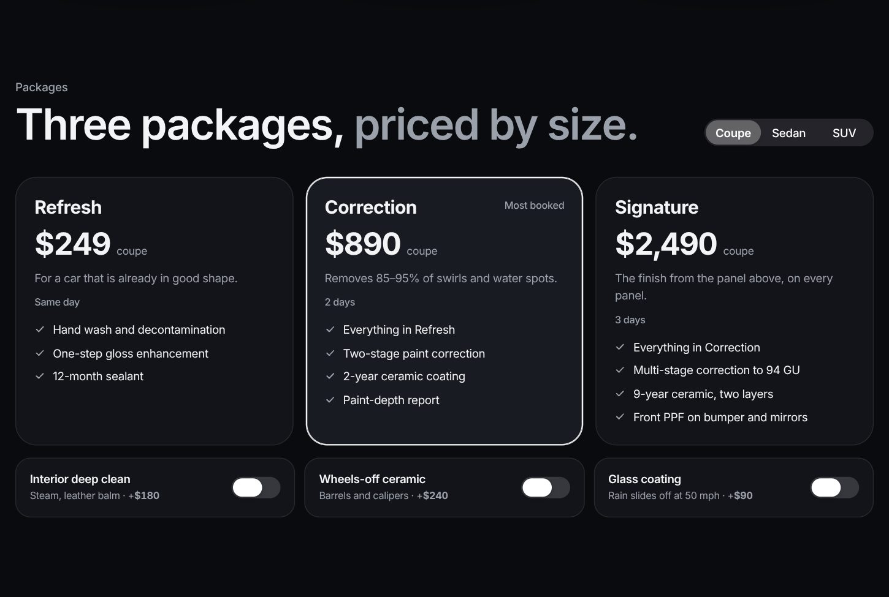
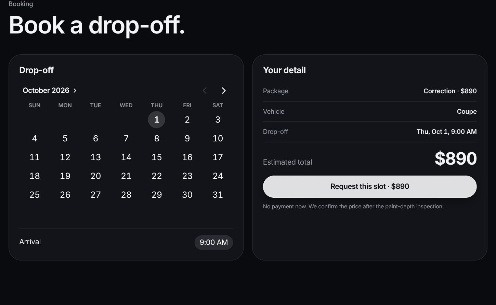
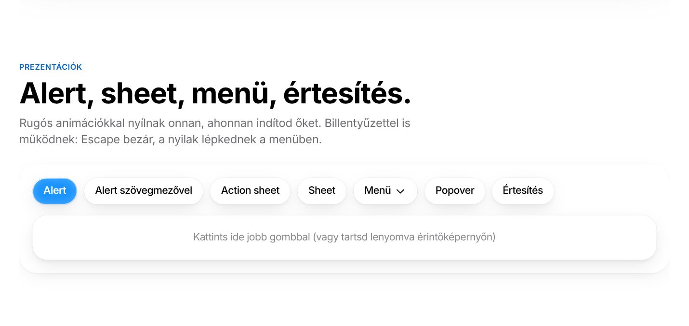

<p align="center"></p>

# Liquid Glass Kit

**Apple's Liquid Glass for the web: real refraction, iOS 26 / macOS 26 components, React and Next.js support.** One `<link>` and one `<script>`, or `npm install`, and you are done.

**[Live demo](https://noexgeci.github.io/liquid-glass-and-more-apple/)** · **[Example landing page](https://noexgeci.github.io/liquid-glass-and-more-apple/detailing/)** · [Component reference](docs/COMPONENTS.md) · [English docs ↓](#english) · [Magyar ↓](#tartalom)

<table>
  <tr>
    <td width="50%"><br><sub><b>Materials</b> · regular, clear, tinted and adaptive glass with a per-element refraction map</sub></td>
    <td width="50%"><br><sub><b>Controls</b> · buttons, switches, sliders, segmented control, wheel picker, calendar</sub></td>
  </tr>
  <tr>
    <td width="50%"><br><sub><b>Example page</b> · a dark, monochrome landing page built only from the kit</sub></td>
    <td width="50%"><br><sub><b>Booking</b> · calendar, time picker and live pricing on the same page</sub></td>
  </tr>
  <tr>
    <td colspan="2"><br><sub><b>Presentations</b> · alerts, sheets, menus, popovers and notifications open from where you tap, in the top layer</sub></td>
  </tr>
</table>

## Magyarul

**Apple Liquid Glass UI a webre: valódi fénytöréssel, iOS 26 / macOS 26 komponensekkel, React és Next.js támogatással.**
Egy sima `<link>` és `<script>`, vagy `npm install`, és kész.

> Mivel még nincs olyan UI, amit bárki letölthet és egyből használhat weboldalhoz vagy webfejlesztéshez, mi készítjük el az 1:1 Liquid Glasst az apple.com-os stílusban. Minden érték (színek, betűméretek, betűközök, vezérlőméretek) az Apple [Human Interface Guidelines](https://developer.apple.com/design/) oldaláról származik.

**Élő demó:** [noexgeci.github.io/liquid-glass-and-more-apple](https://noexgeci.github.io/liquid-glass-and-more-apple/) (a GitHub Pages egyszeri bekapcsolása után: Settings → Pages → Source: *GitHub Actions*). Helyben: `npm run serve`, majd [localhost:3000](http://localhost:3000).

---

## Tartalom

- [Mit tud?](#mit-tud)
- [Telepítés](#telepítés)
- [Gyors kezdés (HTML)](#gyors-kezdés-html)
- [Next.js](#nextjs-app-router)
- [React + Vite](#react--vite)
- [Electron](#electron)
- [Vue, Svelte, Astro, Angular](#vue-svelte-astro-angular)
- [Komponensek](#komponensek)
- [JavaScript API](#javascript-api)
- [Ikonok és az Apple SF Symbols](#ikonok-és-az-apple-sf-symbols)
- [Témák és testreszabás](#témák-és-testreszabás)
- [Böngészőtámogatás](#böngészőtámogatás)
- [Teljesítmény](#teljesítmény)
- [Akadálymentesség](#akadálymentesség)
- [Fejlesztés](#fejlesztés)

## Mit tud?

- **Valódi fénytörés (lensing).** Minden üvegfelület saját, méretre generált SVG displacement mapot kap: a konvex üvegperem úgy hajlítja meg a mögötte lévő tartalmat, mint az iOS 26-ban. Chromium-alapú böngészőkben (Chrome, Edge, Opera, Brave, Arc) és **Electronban** teljes pompájában működik, Safariban és Firefoxban szép blur-os üvegre vált vissza.
- **Tükröződő perem (specular rim),** ami követi az egeret, és **fény a lenyomás helyén,** ahogy az Apple üveg gombjai „felragyognak”.
- **Folyékony interakciók:** a kapcsoló gombja lenyomva üveglencsévé válik és felnagyítja a sávot; a csúszka, a szegmensvezérlő és a tab bar kijelölése húzható lencse; rugós (spring) animációk mindenhol.
- **Apple HIG pontos értékek:** iOS 26 rendszerszínek (világos, sötét, **nagy kontraszt**), Dynamic Type skála, SF Pro betűköz-táblázat, SF Pro változó súlyok (510, 590), HIG vezérlőméretek (28 / 32 / 44 / 52 / 64 pt).
- **45 komponens:** iOS naptár (dátumválasztó) és időválasztó, görgős választó (wheel picker), gombok, kapcsoló gombok, gombcsoportok, pop-up gomb, kinyitható szakasz, kártya, súgócímke, kapcsoló, csúszka, szegmensvezérlő, léptető, szöveg- és keresőmező, navigációs sáv nagy címmel, eszköztár, lebegő tab bar (görgetéskor összecsukódik), oldalsáv, apple.com-stílusú globális navigáció, listák, alert, action sheet, sheet detentekkel, menü, popover, jobb klikkes menü, értesítés (toast), progress, spinner, gyűrű, lapozó pöttyök, badge, macOS ablak közlekedési lámpákkal.
- **Adaptív üveg:** a tab bar, eszköztár vagy bármely üvegfelület (`data-lg-adaptive`) a mögötte lévő tartalom fényessége szerint vált világos és sötét megjelenés között, ahogy az iOS-ben.
- **Folyékony húzás:** a húzott lencsék a sebességgel megnyúlnak, elengedéskor rugósan visszaállnak.
- **Sötét mód** automatikusan (`light-dark()`), vagy bármely részfára kényszerítve.
- **SSR-biztos** mag (Next.js szerverkomponensek importálhatják), **`'use client'`** React build, **TypeScript** típusok.
- **SF Symbols nevek** az ikonokhoz, és egy hívással bekötheted az eredeti Apple SF Symbols SVG-ket.
- **Nulla függőség.** A mag ~36 KB minifikálva, a CSS ~55 KB.

## Telepítés

### npm (GitHubról)

```bash
npm install github:noexgeci/liquid-glass-and-more-apple
```

A csomag neve `liquid-glass-kit`, így importálod:

```js
import 'liquid-glass-kit/css';          // stílusok
import { start } from 'liquid-glass-kit'; // vanilla JS mag
import { Button } from 'liquid-glass-kit/react'; // React komponensek
```

### CDN (letöltés nélkül)

```html
<link rel="stylesheet" href="https://cdn.jsdelivr.net/gh/noexgeci/liquid-glass-and-more-apple@main/dist/liquid-glass.min.css">
<script src="https://cdn.jsdelivr.net/gh/noexgeci/liquid-glass-and-more-apple@main/dist/liquid-glass.min.js" defer></script>
```

### Letöltés

Másold be a projektedbe a `dist/liquid-glass.css` és `dist/liquid-glass.js` fájlt. Ennyi.

## Gyors kezdés (HTML)

```html
<!doctype html>
<html lang="hu">
<head>
  <meta charset="utf-8">
  <meta name="viewport" content="width=device-width, initial-scale=1">
  <link rel="stylesheet" href="dist/liquid-glass.css">
</head>
<body class="lg">
  <button class="lg-button">Üveg gomb</button>
  <button class="lg-button lg-button--prominent">Kész</button>

  <label class="lg-switch"><input type="checkbox" checked></label>

  <div class="lg-slider"><input type="range" min="0" max="100" value="40"></div>

  <div class="lg-segmented">
    <label><input type="radio" name="nezet" checked>Nap</label>
    <label><input type="radio" name="nezet">Hét</label>
    <label><input type="radio" name="nezet">Hónap</label>
  </div>

  <script src="dist/liquid-glass.js"></script>
</body>
</html>
```

A `liquid-glass.js` magától elindul: megkeresi a komponenseket, fénytörést ad az üvegfelületeknek, és figyeli a később hozzáadott elemeket is. A `.lg` osztály a `<body>`-n beállítja az SF Pro betűtípust, a méretet és a színeket (nem kötelező).

> **Tipp:** az üveg akkor mutat igazán, ha van mögötte valami: kép, színátmenet, görgő tartalom.

## Next.js (App Router)

```bash
npm install github:noexgeci/liquid-glass-and-more-apple
```

`app/layout.tsx`:

```tsx
import 'liquid-glass-kit/css';
import { LiquidGlassProvider } from 'liquid-glass-kit/react';

export default function RootLayout({ children }: { children: React.ReactNode }) {
  return (
    <html lang="hu">
      <body className="lg">
        <LiquidGlassProvider>{children}</LiquidGlassProvider>
      </body>
    </html>
  );
}
```

`app/page.tsx` (szerverkomponens is lehet, a komponensek maguk `'use client'`-ek):

```tsx
import { Button, Switch, TabBar, Glass } from 'liquid-glass-kit/react';

export default function Page() {
  return (
    <main>
      <Glass style={{ padding: 24 }}>
        <Button variant="prominent">Vásárlás</Button>
        <Switch defaultChecked label="Wi-Fi" />
      </Glass>
      <TabBar
        items={[
          { value: 'home', label: 'Főoldal', icon: <HomeIcon /> },
          { value: 'search', label: 'Keresés', icon: <SearchIcon /> },
        ]}
        minimizeOnScroll
      />
    </main>
  );
}
```

Vezérelt állapot, ahogy Reactban megszokott:

```tsx
'use client';
import { useState } from 'react';
import { Sheet, Button, SegmentedControl, alert } from 'liquid-glass-kit/react';

export function Beallitasok() {
  const [open, setOpen] = useState(false);
  const [nezet, setNezet] = useState('nap');
  return (
    <>
      <SegmentedControl options={[{ value: 'nap', label: 'Nap' }, { value: 'het', label: 'Hét' }]} value={nezet} onValueChange={setNezet} />
      <Button onClick={() => setOpen(true)}>Megnyitás</Button>
      <Sheet open={open} onOpenChange={setOpen} title="Beállítások" detents={['medium', 'large']}>
        Tartalom
      </Sheet>
      <Button
        destructive
        onClick={async () => {
          const valasz = await alert({
            title: 'Törlöd a fotót?',
            message: 'Ez nem vonható vissza.',
            actions: [{ label: 'Mégse', role: 'cancel' }, { label: 'Törlés', role: 'destructive', prominent: true }],
          });
        }}
      >
        Törlés
      </Button>
    </>
  );
}
```

Teljes példa: [`examples/nextjs`](examples/nextjs).

## React + Vite

```tsx
// main.tsx
import 'liquid-glass-kit/css';
import { LiquidGlassProvider } from 'liquid-glass-kit/react';

createRoot(document.getElementById('root')!).render(
  <LiquidGlassProvider theme="auto">
    <App />
  </LiquidGlassProvider>
);
```

Példa: [`examples/vite-react`](examples/vite-react).

## Electron

Az Electron Chromiumot használ, így **a teljes fénytörés mindig működik.** macOS-en a natív vibrancyval együtt a legszebb:

```js
// main.js
const win = new BrowserWindow({
  width: 1100,
  height: 720,
  titleBarStyle: 'hiddenInset',  // közlekedési lámpák a tartalomban
  vibrancy: 'under-window',      // macOS: natív üveg az ablak mögött
  visualEffectState: 'active',
  backgroundMaterial: 'acrylic', // Windows 11
  backgroundColor: '#00000000',
});
```

A rendererben ugyanúgy használod, mint bármely weboldalon (`<link>` + `<script>`, vagy bundlerrel importálva). Az ablak húzható részeihez: `class="lg-drag"`, a benne lévő gombok automatikusan kattinthatók maradnak (`lg-no-drag`).

Példa: [`examples/electron`](examples/electron).

**Teljes oldal példa:** [`examples/detailing`](examples/detailing), a *Lustre* kitalált autókozmetikai stúdió landing oldala: élőben renderelt before/after festékpanel Liquid Glass fogantyúval, csomagárazás autóméret szerint, foglalás naptárral és időválasztóval.

## Vue, Svelte, Astro, Angular

A CSS osztályok keretrendszer-függetlenek. A kliens oldalon egyszer indítsd el a magot, és az új elemeket magától felismeri:

```js
import 'liquid-glass-kit/css';
import { start } from 'liquid-glass-kit';

start(); // vagy: import 'liquid-glass-kit/auto';
```

Példa: [`examples/vue`](examples/vue) (`v-model` a kapcsolón, csúszkán és szegmensen, húzással is). SvelteKit: `onMount` a gyökér layoutban. Astro: `<script>` a layoutban. Nuxt: a hidratálás után indítsd, különben a mag a Vue előtt nyúlna a szerveren renderelt HTML-hez:

```ts
// plugins/liquid-glass.client.ts
import { start } from 'liquid-glass-kit';
export default defineNuxtPlugin((nuxtApp) => {
  nuxtApp.hook('app:mounted', () => start());
});
```

Szerveroldali renderelésnél (Next.js, Remix, Nuxt, SvelteKit) a mag mindig a hidratálás után induljon: Reactben a `LiquidGlassProvider` ezt magától így csinálja; az `import 'liquid-glass-kit/auto'` sima HTML-oldalakra és kliensoldali appokra való.

## Komponensek

| Komponens | HTML | React |
| --- | --- | --- |
| Üvegfelület | `<div class="lg-glass">` (+ `--clear`, `--tinted`, `--prominent`, `--thick`, `--dimmed`) | `<Glass variant="clear">` |
| Adaptív üveg | `data-lg-adaptive` bármely üveg elemen vagy tab baron | `<Glass adaptive>`, `<TabBar adaptive>` |
| Gomb | `<button class="lg-button">` (+ `--prominent`, `--clear`, `--bordered`, `--filled`, `--plain`, `--small`, `--large`, `--icon`) | `<Button variant="prominent" size="large">` |
| Kapcsoló gomb | `<button class="lg-button" data-lg-toggle aria-pressed="false">` | `<ToggleButton pressed onPressedChange>` |
| Gombcsoport | `<div class="lg-group lg-glass">` | `<ButtonGroup>` |
| Pop-up gomb | `<select class="lg-select">` | `<Select>` |
| Kinyitható szakasz | `<details class="lg-disclosure"><summary>…</summary><div class="lg-disclosure-content">` | `<Disclosure title>` |
| Kártya (tartalomréteg) | `<div class="lg-card">` | `<Card>` |
| Súgócímke | `data-lg-tooltip="Szöveg"` bármely elemen | `data-lg-tooltip` |
| Kapcsoló | `<label class="lg-switch"><input type="checkbox"></label>` | `<Switch checked onCheckedChange>` |
| Csúszka | `<div class="lg-slider" data-lg-ticks="5"><input type="range"></div>` | `<Slider value onValueChange ticks={5}>` |
| Szegmensvezérlő | `<div class="lg-segmented">` + rádiók | `<SegmentedControl options value onValueChange>` |
| Léptető | `<div class="lg-stepper" data-min="0" data-max="10">` | `<Stepper min max value onValueChange>` |
| Görgős választó | `<div class="lg-picker"><div class="lg-picker-column">` + `.lg-picker-item` sorok | `<Picker><PickerColumn items value onValueChange /></Picker>` |
| Dátumválasztó (naptár) | `<div class="lg-calendar" data-value="2026-09-28">` · kompakt: `<div class="lg-date-picker">` | `<Calendar value onValueChange />` · `<DatePicker />` |
| Időválasztó | `<div class="lg-time-picker" data-value="09:41">` | `<TimePicker value onValueChange step />` |
| Szövegmező | `<input class="lg-textfield">` | `<TextField>` |
| Kereső | `<div class="lg-search lg-glass"><svg/><input></div>` | `<SearchField>` |
| Navigációs sáv | `<header class="lg-navbar lg-navbar--large">` | `<NavigationBar large title leading trailing>` |
| Eszköztár | `<div class="lg-toolbar">` | `<Toolbar>` |
| Tab bar | `<nav class="lg-tabbar" data-lg-minimize-on-scroll>` | `<TabBar items value onValueChange search minimizeOnScroll>` |
| Oldalsáv | `<nav class="lg-sidebar lg-glass">` | `<Sidebar>`, `<SidebarItem>` |
| Globális nav | `<div class="lg-globalnav">` | `<GlobalNav brand links>` |
| Lista | `<section class="lg-list-section"><ul class="lg-list">` | `<ListSection header footer>`, `<ListRow>` |
| Alert | `LiquidGlass.alert({...})` | `alert({...})` |
| Action sheet | `LiquidGlass.actionSheet({...})` | `actionSheet({...})` |
| Sheet | `<div class="lg-sheet" hidden>` + `data-lg-sheet="#id"` | `<Sheet open onOpenChange detents>` |
| Menü | `<div class="lg-menu" hidden>` + `data-lg-menu="#id"` | `<Menu trigger={...}><MenuItem/></Menu>` |
| Jobb klikkes menü | `data-lg-context-menu="#id"` | `data-lg-context-menu` |
| Popover | `<div class="lg-popover" hidden>` + `data-lg-popover="#id"` | `<Popover trigger>` |
| Értesítés | `LiquidGlass.toast({...})` | `toast({...})` |
| Progress | `<progress class="lg-progress">` | `<ProgressBar>` |
| Gyűrű | `<span class="lg-ring" style="--lg-value:.6">` | `<ProgressRing value={0.6}>` |
| Spinner | `<span class="lg-spinner"></span>` | `<Spinner>` |
| Lapozó | `<div class="lg-page-control" data-count="5">` | `<PageControl count={5}>` |
| Badge | `<span class="lg-badge">3</span>` | `<Badge>3</Badge>` |
| Ikon | `<span data-lg-icon="magnifyingglass"></span>` | `<Icon name="magnifyingglass" />` |
| macOS ablak | `<div class="lg-window">` + `.lg-traffic-lights` | `<Window title sidebar toolbar>` |
| Tipográfia | `.lg-large-title`, `.lg-title-1…3`, `.lg-headline`, `.lg-body`, `.lg-callout`, `.lg-subheadline`, `.lg-footnote`, `.lg-caption-1/2` | ugyanezek az osztályok |

Az összes komponens élőben: nyisd meg az [`index.html`](index.html) demót. Részletes referencia minden komponenshez (HTML és React kóddal, attribútumokkal, eseményekkel): [`docs/COMPONENTS.md`](docs/COMPONENTS.md).

## JavaScript API

```js
import {
  start, stop, init, enhance, destroy, refresh, select,
  alert, actionSheet, toast, menu, sheet, openPopover, closePopover,
  refract, unrefract, supportsRefraction, setTheme, configure,
  icon, registerIcons,
} from 'liquid-glass-kit';
```

A script tag build ugyanezt adja a `window.LiquidGlass` objektumon.

| Függvény | Leírás |
| --- | --- |
| `start(options?)` | Globális viselkedések + a dokumentum feldolgozása. Idempotens. `options`: `{ refraction: 'auto' \| true \| false, dynamicLight: true, observe: true }` |
| `init(root?)` / `enhance(el)` / `destroy(el)` | Kézi feldolgozás és takarítás (SPA-khoz). |
| `alert({ title, message, actions, input })` | Promise, a választott gomb `value`-jával vagy címkéjével. `input`-tal `{ action, value }`. |
| `actionSheet({ title, message, actions })` | Alsó megerősítő panel. |
| `toast({ title, message, icon, time, duration })` | Értesítés felül, felfelé húzva eltűnik. |
| `menu(anchor, items)` | Menü menet közben, Promise a választással. |
| `sheet(el).open('medium' \| 'large')` | Sheet vezérlő: `open`, `close`, `toggle`, `setDetent`. |
| `refract(el, { bezel, depth, magnify })` | Fénytörés bármely elemre. |
| `select(el, index)` | Szegmens, tab bar vagy lapozó programból. |
| `setTheme('light' \| 'dark' \| 'auto')` | Téma váltás. |
| `registerIcons({ név: svg })` | Saját vagy SF Symbols SVG-k regisztrálása (SF nevekkel). |
| `icon(név, { size })` | Ikon SVG szövegként. |
| `hasIcon(név)` / `isRegisteredIcon(név)` | Van-e ilyen ikon / regisztráltál-e hozzá saját (SF Symbols) SVG-t. |
| `openPopover(panel, anchor)` / `closePopover(immediate?, panel?)` | Menü vagy popover nyitása/zárása programból. |

Események: `lg-change` (szegmens gombokkal, tab bar, léptető, lapozó, `data-lg-toggle`), `lg-select` (menü), `lg-open` / `lg-close` (menü, sheet), `lg-detent` (sheet).

## Ikonok és az Apple SF Symbols

A kit az Apple **SF Symbols neveit** használja: `magnifyingglass`, `chevron.left`, `square.and.arrow.up`, `gearshape`, `house.fill`, `play.fill` és így tovább.

```html
<span data-lg-icon="magnifyingglass"></span>
```
```tsx
<Icon name="square.and.arrow.up" />
```

**Az eredeti SF Symbols ikonokat a kit nem tartalmazza, és nem is tartalmazhatja:** az Apple licence szerint az SF Symbols csak Apple-platformra készülő appokban használható, és nem terjeszthető tovább. Ha a te felhasználásodat a licenc lehetővé teszi (például macOS-re készülő Electron app), exportáld az SVG-ket az Apple [SF Symbols](https://developer.apple.com/sf-symbols/) appjából, és regisztráld őket egyetlen hívással. Onnantól mindenhol az eredeti Apple ikon jelenik meg:

```js
import { registerIcons } from 'liquid-glass-kit';

registerIcons({
  magnifyingglass: magnifyingglassSvg, // az SF Symbols appból exportált SVG szövege
  'chevron.left': chevronLeftSvg,
  'square.and.arrow.up': shareSvg,
});
```

Amíg egy nevet nem regisztrálsz, a kit saját, SF-stílusú tartalék ikonja jelenik meg (86 darab, az SF nevekkel és rövid nevekkel is elérhető). A betűtípus Apple eszközökön az eredeti SF Pro, mert a rendszerből jön.

## Témák és testreszabás

Minden szín és méret CSS változó. Például kiemelőszín:

```css
:root { --lg-accent: var(--lg-purple); }
```

Egy elem színezése: `style="--lg-tint: var(--lg-orange)"` (gombok, üveg), `--lg-switch-tint`, `--lg-slider-tint`, `--lg-tabbar-tint`.

Sötét mód: automatikus. Kényszerítés: `data-lg-theme="dark"` vagy `class="lg-dark"` bármely elemen (részfára is). Üveg paraméterek: `--lg-glass-blur`, `--lg-glass-fill`, `--lg-glass-saturate`, `--lg-light-angle`. Elemenként: `data-lg-bezel`, `data-lg-depth`, `data-lg-magnify`, vagy `data-lg-refraction="off"`.

Rendszerszínek: `--lg-red`, `--lg-orange`, `--lg-yellow`, `--lg-green`, `--lg-mint`, `--lg-teal`, `--lg-cyan`, `--lg-blue`, `--lg-indigo`, `--lg-purple`, `--lg-pink`, `--lg-brown`, `--lg-gray` … `--lg-gray-6`. Szemantikus: `--lg-label(-secondary/-tertiary/-quaternary)`, `--lg-fill(-secondary/…)`, `--lg-bg(-secondary/-tertiary)`, `--lg-bg-grouped(…)`, `--lg-separator`.

### Kontraszt és apple.com színek

Az iOS színek 1:1 az Apple értékei, ezért néhány (például a másodlagos szürke szöveg vagy a kék fehér alapon) nem éri el a WCAG AA 4,5:1 arányt, ahogy az iOS-ben sem. Két Apple-hiteles megoldás:

- `data-lg-contrast="more"` (vagy `.lg-contrast-more`) bármely elemen: az Apple hivatalos „Kontraszt növelése” színeire vált, erősebb címkékkel. A rendszerbeállítást (`prefers-contrast: more`) automatikusan is követi. Ezzel a demó oldal automatikus akadálymentességi auditja (axe-core) hibamentes.
- Weboldal-szövegekhez az apple.com saját palettája: `--lg-web-text` (#1d1d1f), `--lg-web-text-secondary` (#6e6e73), `--lg-web-link` (#0066cc), `--lg-web-bg`, `--lg-web-bg-alt`.

## Böngészőtámogatás

| Böngésző | Eredmény |
| --- | --- |
| Chrome, Edge, Opera, Brave, Arc 111+ · Electron 24+ | Teljes Liquid Glass: fénytörés, lencsék, perem, blur |
| Safari 16.4+ (macOS, iOS) | Üveg blurral, peremmel, minden interakció (SVG fénytörés nélkül, ezt a WebKit nem támogatja backdrop-filterben) |
| Firefox 121+ | Mint a Safari |

A fénytöréshez a Chromium GPU-raszterizálása kell (asztali Chrome-ban és Electronban alapértelmezett). Kikapcsolás: `start({ refraction: false })`. Az alapértelmezett `'auto'` mód gyenge érintőképernyős eszközökön (legfeljebb 4 GB memória vagy 4 mag) és Adatforgalom-csökkentés mellett a könnyebb, blurral dolgozó üveget használja, hogy a görgetés ott is sima maradjon; `refraction: true` ezt felülírja.

A felugró elemek (alert, action sheet, sheet, menü, popover, értesítés, súgócímke) a böngésző **top layerében** jelennek meg a Popover API-val (Chrome/Edge 114+, Safari 17+, Firefox 125+): a helyükön maradnak a DOM-ban (űrlap, téma és React fa sértetlen), mégsem vághatja le vagy takarhatja ki őket semmilyen `transform`, `overflow` vagy `z-index`. Régebbi böngészőben nyitás idejére a `<body>`-ba kerülnek, zárás után vissza.

## Teljesítmény

- A displacement mapokat méret szerint cache-eli és újrahasznosítja; azonos méretű gombok egyetlen SVG szűrőn osztoznak.
- Animáció közben (átméretezés) a meglévő map nyúlik, és csak a mozgás végén generál újat.
- A nagy felületek mapja legfeljebb 200 px oldalú (a torzítás sima, így élesen skálázható), és csak akkor készül el, amikor az elem a képernyő közelébe ér, képkockánként néhány ms-os kerettel.
- Az interakciók csak `transform`, `opacity` és CSS változók animálásával dolgoznak: kompozitorban futnak, 60/120 fps.
- A dinamikus fény egy `requestAnimationFrame`-mel fojtott CSS változó.
- Használd mértékkel: az Apple is azt javasolja, hogy a Liquid Glass a vezérlőréteg legyen, ne a tartalomé.

## Akadálymentesség

- Natív `input` elemek maradnak alatta (billentyűzet, képernyőolvasó, űrlapok működnek).
- `prefers-reduced-transparency` → átlátszatlan üveg, `prefers-reduced-motion` → rugók helyett rövid átmenet, `prefers-contrast: more` → HIG nagy kontrasztú színek.
- Fókuszgyűrű mindenhol, fókuszcsapda a dialógusokban, Escape mindig a legfelső réteget zárja, nyilakkal navigálható menü.
- Windows nagy kontrasztú mód (`forced-colors`): átlátszatlan felületek rendszerszínű kerettel, a kapcsolók, csúszkák, szegmensek és jelzők állapota `Highlight` színnel látszik.
- Jobbról balra írás (`dir="rtl"`, arab, héber): a kapcsoló, a csúszka és a menük tükröződnek, ahogy iOS-en; az SF Symbols `…backward` / `…forward` ikonjai (`chevron.backward`) megfordulnak, a `chevron.left` nem.
- A súgócímke billentyűzetfókuszra is megjelenik, és a saját `aria-describedby` értékedhez adódik hozzá.
- Nyomtatáskor lapos, tintatakarékos felületek; menük, értesítések és lebegő sávok nem kerülnek papírra.

## Fejlesztés

```bash
npm install
npm run build   # dist/ újragenerálása
npm run dev     # figyelő mód
npm test        # build + böngészős interakciós teszt (Playwright szükséges)
```

A forrás a `src/` mappában van: `liquid-glass.css`, `core.js` (mag), `react.jsx`, a típusok a `types/` mappában.

## Licenc

MIT. Az Apple, iOS, macOS, SF Pro és Liquid Glass az Apple Inc. védjegyei. Ez a projekt független, az Apple nem támogatja és nem áll kapcsolatban vele. Nem tartalmaz Apple betűtípust, ikont vagy képet: a rendszer SF Pro betűjét használja ott, ahol elérhető (Apple eszközökön), máshol a rendszer alapértelmezett betűjét.

---

<a id="english"></a>

## English

**Liquid Glass Kit** brings Apple's Liquid Glass to the web: real refraction, iOS 26 / macOS 26 components, React bindings, and values taken from Apple's Human Interface Guidelines.

### Install

```bash
npm install github:noexgeci/liquid-glass-and-more-apple
```

```js
import 'liquid-glass-kit/css';
import { start } from 'liquid-glass-kit';        // vanilla
import { Button, Switch } from 'liquid-glass-kit/react'; // React / Next.js
```

Or with plain tags:

```html
<link rel="stylesheet" href="https://cdn.jsdelivr.net/gh/noexgeci/liquid-glass-and-more-apple@main/dist/liquid-glass.min.css">
<script src="https://cdn.jsdelivr.net/gh/noexgeci/liquid-glass-and-more-apple@main/dist/liquid-glass.min.js" defer></script>
```

### Highlights

- Per-element SVG displacement maps model a convex glass rim, so content bends at the edges like iOS 26 (Chromium engines and Electron; Safari and Firefox get a blurred-glass fallback).
- Specular rim that follows the pointer, touch-point illumination, spring animations.
- Adaptive glass (`data-lg-adaptive`) flips light/dark with the content underneath, like iOS bars; dragged lenses stretch with speed.
- Switch, slider, segmented control and tab bar selections turn into draggable glass lenses.
- iOS 26 system colors (light, dark, increased contrast), Dynamic Type scale, SF tracking table, HIG control sizes.
- 45 components, including the iOS calendar and time picker, dark mode via `light-dark()`, SSR-safe core, `'use client'` React build, TypeScript types, zero dependencies.
- Alerts, sheets, menus, popovers, toasts and tooltips open in the browser's top layer (Popover API), so they are never clipped or covered, yet stay in place in the DOM: forms, inherited themes and React trees are untouched.

### Next.js

```tsx
// app/layout.tsx
import 'liquid-glass-kit/css';
import { LiquidGlassProvider } from 'liquid-glass-kit/react';

export default function RootLayout({ children }) {
  return (
    <html lang="en">
      <body className="lg">
        <LiquidGlassProvider>{children}</LiquidGlassProvider>
      </body>
    </html>
  );
}
```

### Electron

Electron runs Chromium, so full refraction always works. For a native feel on macOS use `titleBarStyle: 'hiddenInset'`, `vibrancy: 'under-window'` and a transparent `backgroundColor`; mark draggable regions with `class="lg-drag"`. See [`examples/electron`](examples/electron).

### Other frameworks

Vue, Svelte, Astro, Angular, Solid: import the CSS, call `start()` once on the client (or `import 'liquid-glass-kit/auto'`). Components added later are enhanced automatically. With server rendering (Next.js, Remix, Nuxt, SvelteKit) start the kit after hydration — `LiquidGlassProvider` does that in React; in Nuxt use `nuxtApp.hook('app:mounted', () => start())` in a client plugin — so it never touches server-rendered markup before the framework hydrates it.

The component table, API reference and theming guide above apply as-is; class names and function names are in English. Full reference with HTML and React snippets for every component: [`docs/COMPONENTS.md`](docs/COMPONENTS.md).

### Icons and Apple SF Symbols

Icons use **SF Symbols names** (`magnifyingglass`, `chevron.left`, `square.and.arrow.up`, …). Apple's SF Symbols themselves are not bundled: their license limits them to apps for Apple platforms and forbids redistribution. Where your use is covered, export the SVGs from Apple's [SF Symbols](https://developer.apple.com/sf-symbols/) app and call `registerIcons({ magnifyingglass: svg, … })`; every icon on the page switches to the original. Until then the kit's own SF-style fallback glyphs render.

### Contrast

System colors match Apple 1:1, so a few (secondary gray text, blue on white) fall below WCAG AA just as on iOS. Add `data-lg-contrast="more"` to switch to Apple's official Increased Contrast colors (the OS setting applies them automatically), and use the apple.com web palette (`--lg-web-text`, `--lg-web-text-secondary`, `--lg-web-link`) for long-form text.

### License

MIT. Apple, iOS, macOS, SF Pro and Liquid Glass are trademarks of Apple Inc. This project is independent and not affiliated with or endorsed by Apple. No Apple fonts, icons or images are bundled.
